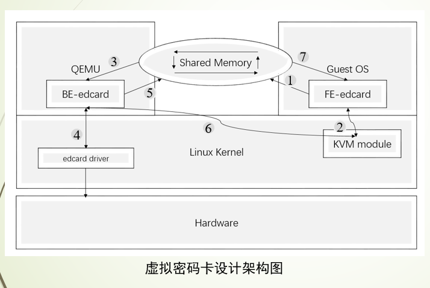
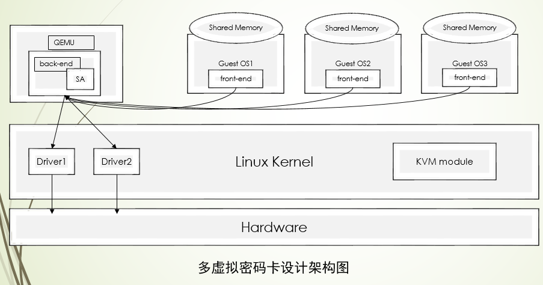

# 主要工作
- 使用virtio框架，采用前后端设备模拟的方式，在虚拟机中添加一个虚拟密码卡（属于blk设备）。前端将客户机的请求发送给qemu中的后端，后端将会与根据前端发来的请求与真实的物理设备进行交互，得到处理结果后将会把结果返回给前端。前后端通信机制用了virtioqueue和virtioring，queue中放置请求和通知信息，ring由前后端共享，用于放置数据。
- 设计并实现多个虚拟机竞争虚拟密码卡资源的资源调度方案（借鉴最高响应比算法，分子和分母都加上一个影响因子n，在编译qemu时指定n值）。当没有密码卡资源可用时，通过信号量和共享缓冲区的同步机制去限制多个qemu进程对密码卡设备的访问，当有密码卡资源空闲下来时，优先级最高的密码卡使用申请将会获得密码卡使用权。
- 设计并实现了虚拟密码的动态迁移方案（在设备结构体中有save和load两个函数指针，用于迁移前的保存和迁移后的恢复），主要是在这两个函数中设计保存与恢复的方案，以及对密码卡资源的释放和竞争。
# 架构图
- 前后端方式的虚拟密码卡  

- 多个虚拟机竞争有限的密码卡资源  

# 文件说明
```
qemu-2.9.1中是修改后的QEMU，里面添加了一个BLK后端设备作为虚拟密码卡的后端。
Frontend.zip中是BLK前端设备，应该编译运行在客户机中，系统测试时用的是OpenSUSE-15.3系统。
EDcard.zip中是Linux下的字符设备驱动程序模拟的密码卡（缺少硬件密码卡来提供测试环境）。

测试时，上面三份代码都要在新的环境中重新编译运行。

OpenSUSE的iso下载地址：https://mirror.bjtu.edu.cn/opensuse/tumbleweed/iso/

加载密码卡驱动程序：sudo insmod /home/lm/Desktop/encrytioncard/edcard.ko

QEMU的运行命令：sudo ./qemu-system-x86_64 --enable-kvm -m 2G -smp 2 -boot c -hda ../tmp/OpenSUSE-disk.qcow2 -monitor stdio

前端程序通过桥接网络（需要自己根据自己的网络设置情况为QEMU配置）和ssh服务传到客户机中，并编译，然后，insmod命令加载模块。

Frontend中有测试程序test.c, 编译运行就会加解密plain文件，可以比较plain和result文件来确定功能的正确性。
```
